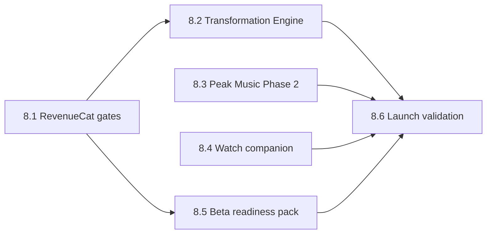

# Sprint 8.0 — Implementation Plan (Authorized)

**Authorization date:** 2026-05-31  
**Prerequisite:** Sprint 7.9 gate **12/12 PASS**, Beta Readiness **100/100** ✅  
**Status:** **AUTHORIZED — planning only; no coding started**

See closure report: [SPRINT79_CLOSURE_REPORT.md](./SPRINT79_CLOSURE_REPORT.md)

---

## Executive summary

Sprint 8 delivers monetization, differentiation (Transformation Engine), Peak Music Phase 2, Watch companion sync, beta operations pack, and launch validation. Estimated calendar time: **4–6 weeks** to closed beta; **6–8 weeks** to App Store submission.

---

## Development order & dependencies

| Order | Sprint slice | Depends on | Blocks |
|-------|--------------|------------|--------|
| 1 | **8.1 RevenueCat & subscriptions** | Sprint 7.9 gate | Paid feature gates, ASC linkage |
| 2 | **8.2 Transformation Engine** | Body photos API, migration | Pro tier value prop |
| 3 | **8.3 Peak Music Phase 2** | Dev client, Apple MusicKit | Voice “peak sync” commands |
| 4 | **8.4 Apple Watch companion** | HealthKit dev build, WatchConnectivity | Watch beta testers |
| 5 | **8.5 Beta user readiness** | 8.1 (optional free tier path) | Closed beta invite |
| 6 | **8.6 Launch validation** | All above | App Store submission |

---

## Sprint 8.1 — RevenueCat & subscription gates (Week 1)

**Goal:** Monetization foundation; gate Pro features.

| Task | Estimate | Owner |
|------|----------|-------|
| App Store Connect: `com.liftflow.app.premium.monthly` @ $9.99 | 2h | Ops |
| RevenueCat project + iOS app + entitlement `pro` | 2h | Ops |
| EAS secret `EXPO_PUBLIC_REVENUECAT_IOS_API_KEY` | 30m | Ops |
| Wire `useSubscription` / `PremiumGate` to intelligence tabs | 1d | Dev |
| Sandbox purchase E2E | 4h | QA |
| Webhook → Supabase `subscriptions` verification | 4h | Dev |

**Deliverable:** `scripts/validate-sprint81-revenuecat.mjs` (new)  
**Exit criteria:** Sandbox purchase restores; Coaching tab gated correctly

**Dependencies:** Apple Developer enrollment, ASC access

---

## Sprint 8.2 — Transformation Engine (Week 2)

**Goal:** Before / current / projected body composition UX.

| Task | Estimate | Owner |
|------|----------|-------|
| Migration `011_transformation_projections` | 4h | Dev |
| `transformationEngine.ts` — projection math | 2d | Dev |
| API routes `/api/body/transformation/*` | 1d | Dev |
| UI: side-by-side Before \| Current \| Projected | 2d | Dev |
| Voice intents: “Show my projection”, target BF% | 4h | Dev |
| Integrate success score + adherence signals | 1d | Dev |

**Deliverable:** `scripts/validate-sprint82-transformation.mjs`  
**Exit criteria:** Projection run persisted; UI renders for user with ≥1 progress photo

**Dependencies:** Existing `progress_photos`, body fat estimate API

---

## Sprint 8.3 — Peak Music Sync Phase 2 (Week 3)

**Goal:** Apple Music OAuth + playlist continuity on device.

| Task | Estimate | Owner |
|------|----------|-------|
| Apple MusicKit OAuth flow (dev client) | 3d | Dev |
| Provider adapter: snapshot → peak → restore | 2d | Dev |
| Settings: provider connect + mode selection | 1d | Dev |
| Voice command wiring (patterns exist from 7.X) | 1d | Dev |
| Spotify App Remote spike (optional stretch) | 3d | Dev |

**Deliverable:** `scripts/validate-sprint83-peak-music.mjs`  
**Exit criteria:** User connects Apple Music; workout peak restores prior playlist

**Dependencies:** EAS iOS dev client (not Expo Go), MusicKit entitlement

---

## Sprint 8.4 — Apple Watch companion (Week 4)

**Goal:** Rest timer + session state without phone unlock.

| Task | Estimate | Owner |
|------|----------|-------|
| WatchConnectivity message schema | 1d | Dev |
| iPhone → Watch: active workout, rest timer | 2d | Dev |
| Watch → iPhone: skip rest, log set stub | 1d | Dev |
| Recovery badge on Watch face (companion) | 1d | Dev |
| HealthKit background delivery audit | 4h | Dev |

**Deliverable:** `scripts/validate-sprint84-watch.mjs` (static + dev build)  
**Exit criteria:** Rest timer visible on Watch during active session on physical devices

**Dependencies:** HealthKit dev build, paired Watch hardware

---

## Sprint 8.5 — Beta user readiness pack (Week 4–5, parallel)

**Goal:** Support 25–50 closed beta users.

| Task | Estimate | Owner |
|------|----------|-------|
| Known issues doc + release notes template | 4h | PM |
| Sentry or Expo crash reporting | 1d | Dev |
| In-app feedback (Settings → API/email) | 4h | Dev |
| Beta onboarding email + TestFlight invite flow | 4h | Ops |
| Extend RELEASE_CHECKLIST for beta ops | 2h | PM |

**Deliverable:** `docs/BETA_KNOWN_ISSUES.md`, feedback endpoint  
**Exit criteria:** Crash reports visible; feedback reaches founder inbox

---

## Sprint 8.6 — Launch validation (Week 5–6)

**Goal:** App Store submission readiness.

| Task | Estimate | Owner |
|------|----------|-------|
| Create `scripts/validate-sprint80-launch.mjs` | 1d | Dev |
| App Store screenshots (6.7" + 6.1") | 4h | Design |
| Privacy nutrition labels in ASC | 2h | Ops |
| App Review demo account | 1h | Ops |
| TestFlight soak (1 week, 10+ sessions/user) | 1 week | QA |

**Deliverable:** Launch PASS/FAIL report, production readiness score  
**Exit criteria:** Launch validator PASS; zero P0 bugs in soak

---

## Timeline summary

| Week | Dates | Focus | Milestone |
|------|-------|-------|-----------|
| 1 | Jun 2–6 | RevenueCat + gates | Sandbox IAP works |
| 2 | Jun 9–13 | Transformation Engine | Pro differentiation live |
| 3 | Jun 16–20 | Peak Music Apple OAuth | Music sync on device |
| 4 | Jun 23–27 | Watch companion + beta pack | TestFlight Beta 1 |
| 5 | Jun 30–Jul 4 | Beta soak + fixes | Closed beta 25 users |
| 6 | Jul 7–11 | Launch validation | ASC submission ready |

**Recommended closed beta:** **2026-06-21**  
**Recommended App Store submit:** **2026-07-12** (after soak)

---

## Validators to create (Sprint 8)

| Script | Sprint |
|--------|--------|
| `validate-sprint81-revenuecat.mjs` | 8.1 |
| `validate-sprint82-transformation.mjs` | 8.2 |
| `validate-sprint83-peak-music.mjs` | 8.3 |
| `validate-sprint84-watch.mjs` | 8.4 |
| `validate-sprint80-launch.mjs` | 8.6 (aggregates all) |

Add npm scripts mirroring Sprint 7 pattern.

---

## Out of scope for Sprint 8.0

- Amazon Music / Pandora providers (not feasible per 7.X audit)
- Standalone Watch app (companion only in v1)
- Android Play Store launch (iOS-first beta)
- Audio analysis / copyrighted peak detection

---

## Reference docs

- [SPRINT80_ROADMAP.md](./SPRINT80_ROADMAP.md) — feature priorities
- [RELEASE_CHECKLIST.md](./RELEASE_CHECKLIST.md) — TestFlight steps
- [PLAYLIST_CONTINUITY.md](./PLAYLIST_CONTINUITY.md) — music architecture
- [PEAK_MUSIC_SYNC.md](./PEAK_MUSIC_SYNC.md) — peak sync design
