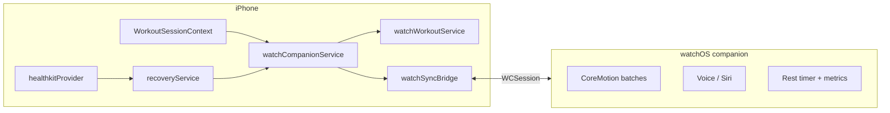

# Apple Watch Companion — Architecture

**Sprint 8.4 · LiftFlow Pro (`apple-watch-advanced`)**

## Overview

LiftFlow uses a **phone-hosted workout assistant** with a native watchOS companion (future EAS dev client). The iPhone owns session state, set logging, recovery intelligence, and recommendations. The Watch streams motion, heart rate, and voice commands via WatchConnectivity.

## Message schema

| Type | Direction | Purpose |
|------|-----------|---------|
| `workout_state` | Phone → Watch | Active set, rest timer, recovery, recommendations |
| `motion_batch` | Watch → Phone | Accelerometer/gyro rep detection |
| `voice_command` | Watch → Phone | Hands-free logging & queries |
| `skip_rest` / `next_set` | Watch → Phone | Rest control |
| `rep_correction` | Watch → Phone | Manual rep fix |
| `workout_sync` | Watch → Phone | HR, steps, calories batch |
| `health_sync` | Watch → Phone | Recovery data sync |

## Phone-side modules

| Module | Path |
|--------|------|
| Assistant state machine | `src/integrations/watch/watchWorkoutAssistant.ts` |
| Voice parser | `src/integrations/watch/watchVoiceCommands.ts` |
| Sync bridge | `src/integrations/watchSyncBridge.ts` |
| Offline queue | `src/integrations/watchOfflineQueue.ts` |
| Companion orchestrator | `src/services/watchCompanionService.ts` |
| Session wiring | `src/hooks/useWatchCompanionSync.ts` |
| UI | `src/app/(features)/apple-watch.tsx` |

## Offline queue

When WatchConnectivity is unavailable (Expo Go, no paired Watch), outbound messages are persisted in AsyncStorage (`@liftflow/watch_offline_queue`) and flushed when connectivity returns.

## Voice intents (Watch + phone)

- Log set / Complete set
- Next set / Skip rest
- What should I do next?
- How recovered am I?
- Rep queries, weight suggestions, progression line

## Health integration

HealthKit on iPhone feeds recovery intelligence (HRV, sleep, resting HR, steps, active calories). Watch can stream live HR during workouts via `heart_rate_sample` messages (native target).

See [HEALTHKIT_REQUIREMENTS.md](./HEALTHKIT_REQUIREMENTS.md) and [WATCH_NATIVE.md](./WATCH_NATIVE.md).
