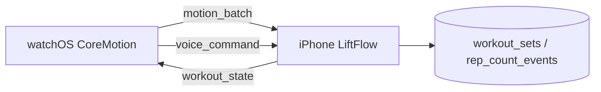

# Apple Watch Native Companion

The TypeScript workout assistant (`src/integrations/watch/`, `watchWorkoutService.ts`) is ready on iPhone. A native **watchOS** target streams motion and receives state via WatchConnectivity.

## Architecture

## Message types (WatchConnectivity)

| type | Direction | Payload |
|------|-----------|---------|
| `workout_state` | Phone → Watch | Full `WatchWorkoutAssistantState` |
| `motion_batch` | Watch → Phone | `samples[]`, `workoutSessionId` |
| `voice_command` | Watch → Phone | `transcript` |
| `rep_correction` | Watch → Phone | `repCount`, ids |
| `confirm_reps` | Watch → Phone | session + exercise ids |

Phone entry: `integrationService.handleWatchMessage()` → `watchWorkoutService.handleIncomingMessage()`.

## watchOS implementation checklist

1. Add **Watch App** target to the Expo dev client / bare workflow Xcode project.
2. Enable **Workout Processing** and **HealthKit** if sharing HR.
3. On workout start, subscribe to `CMMotionManager`:
   - `deviceMotionUpdateInterval` ≈ 0.04s (25 Hz)
   - Batch 20–30 samples, send `motion_batch` to phone.
4. Run **WKExtendedRuntimeSession** during active sets so sensors stay live.
5. Use **WatchConnectivity** `WCSession.sendMessage` for low-latency batches.
6. Present SwiftUI UI: rep count, confidence bar, “Confirm” / “+1 rep” buttons.
7. Optional: **Siri / dictation** → forward transcript as `voice_command`.

## Confidence & fallback

- Rep detection runs in `detectRepsFromMotion()` (peak detection on accelerometer/gyro).
- If `confidence < 0.55`, phone/watch prompts for confirmation.
- User can say **“Correct to rep 8”** or tap manual correction (Apple Watch screen).

## Supported exercises

See `EXERCISE_MOTION_PROFILES` in `src/integrations/watch/exerciseMotionProfiles.ts` (Bench Press, Squats, Rows, etc.).

## Phase 2 (watchOS companion)

Shipped in native target `targets/watch/`:

1. **Motion rep counting — NOT SHIPPED.** `MotionCapture.swift` exists but is never instantiated, so no
   accelerometer/gyro batches are sent and no reps are ever detected. The phone-side pipeline
   (`motion_batch` handling, `EXERCISE_MOTION_PROFILES`, `/api/watch/motion`) is scaffolding awaiting a
   real sensor/ML implementation. User-facing surfaces must present this as coming soon.
2. **Voice on wrist** — Dictation via SwiftUI `TextFieldLink`. (`presentTextInputController` cannot be
   used: it needs a WatchKit interface controller, which does not exist under the SwiftUI lifecycle.)
3. **Richer UI** — Recovery score, progression line, rep count, confirm reps.
4. **Start from Watch** — “Start Today's Workout” sends `start_workout` to iPhone (starts today's planned session).
5. **Live workout session** — `WorkoutSessionManager.swift` runs an `HKWorkoutSession` +
   `HKLiveWorkoutBuilder` for the duration of the workout so watchOS does not suspend the app on
   wrist-down. Requires `WKBackgroundModes: workout-processing` (Info.plist) and the HealthKit
   entitlement. The session stays running through rest periods, and is ended and saved to Health when
   the workout finishes or is cancelled.
6. **Rest timer** — The phone transmits a rest deadline only on meaningful transitions (start, change,
   clear); the watch counts down locally from there. Re-arming on every tick froze the display.

Phone-side handlers were already in `watchWorkoutService` / `watchCompanionService`; Phase 2 wires the native Watch app to use them.

### Complications (Phase 2.5)

Watch face complications for rest timer / active workout are not yet implemented.

## Dev without Watch hardware

- Open `/(features)/apple-watch`
- Start a phone workout → **Sync active workout**
- Enter a rep count manually to drive the same logging pipeline

## Known follow-ups

- **Wrist logging requires the phone's workout screen to be open.** `WatchPhoneBridge` holds its
  session handlers in a module-level singleton populated by `useWatchCompanionSync`, which only
  mounts on the workout screen. Commands sent from the wrist while the phone is elsewhere are
  therefore dropped. Fixing this means hoisting the bridge to an app-level provider (or moving the
  handlers into a background-capable service) — a larger architectural change, deliberately out of
  scope for the current pass.
- Watch-side motion rep counting (see item 1 above) remains unimplemented.

## Backend API (optional direct Watch → API)

- `GET /api/watch/supported-exercises`
- `POST /api/watch/motion` (auth required)
- `POST /api/watch/voice` (auth required, user-scoped progression)

Deploy Render after adding routes in `backend/src/routes/watch.ts`.
