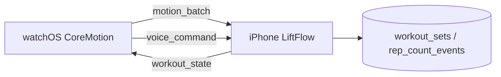

# Apple Watch Native Companion

The TypeScript workout assistant (`src/integrations/watch/`, `watchWorkoutService.ts`) is ready on iPhone. A native **watchOS** target streams motion and receives state via WatchConnectivity.

## Architecture

## Message types (WatchConnectivity)

| type | Direction | Payload |
|------|-----------|---------|
| `workout_state` | Phone → Watch | Full `WatchWorkoutAssistantState` |
| `motion_batch` | Watch → Phone | `samples[]`, `workoutSessionId` |
| `voice_command` | Watch → Phone | `transcript` |
| `rep_correction` | Watch → Phone | `repCount`, ids |
| `confirm_reps` | Watch → Phone | session + exercise ids |

Phone entry: `integrationService.handleWatchMessage()` → `watchWorkoutService.handleIncomingMessage()`.

## watchOS implementation checklist

1. Add **Watch App** target to the Expo dev client / bare workflow Xcode project.
2. Enable **Workout Processing** and **HealthKit** if sharing HR.
3. On workout start, subscribe to `CMMotionManager`:
   - `deviceMotionUpdateInterval` ≈ 0.04s (25 Hz)
   - Batch 20–30 samples, send `motion_batch` to phone.
4. Run **WKExtendedRuntimeSession** during active sets so sensors stay live.
5. Use **WatchConnectivity** `WCSession.sendMessage` for low-latency batches.
6. Present SwiftUI UI: rep count, confidence bar, “Confirm” / “+1 rep” buttons.
7. Optional: **Siri / dictation** → forward transcript as `voice_command`.

## Confidence & fallback

- Rep detection runs in `detectRepsFromMotion()` (peak detection on accelerometer/gyro).
- If `confidence < 0.55`, phone/watch prompts for confirmation.
- User can say **“Correct to rep 8”** or tap manual correction (Apple Watch screen).

## Supported exercises

See `EXERCISE_MOTION_PROFILES` in `src/integrations/watch/exerciseMotionProfiles.ts` (Bench Press, Squats, Rows, etc.).

## Dev without Watch hardware

- Open `/(features)/apple-watch`
- Start a phone workout → **Sync active workout**
- **Simulate rep (dev)** feeds synthetic motion through the same pipeline

## Backend API (optional direct Watch → API)

- `GET /api/watch/supported-exercises`
- `POST /api/watch/motion` (auth required)
- `POST /api/watch/voice` (auth required, user-scoped progression)

Deploy Render after adding routes in `backend/src/routes/watch.ts`.
