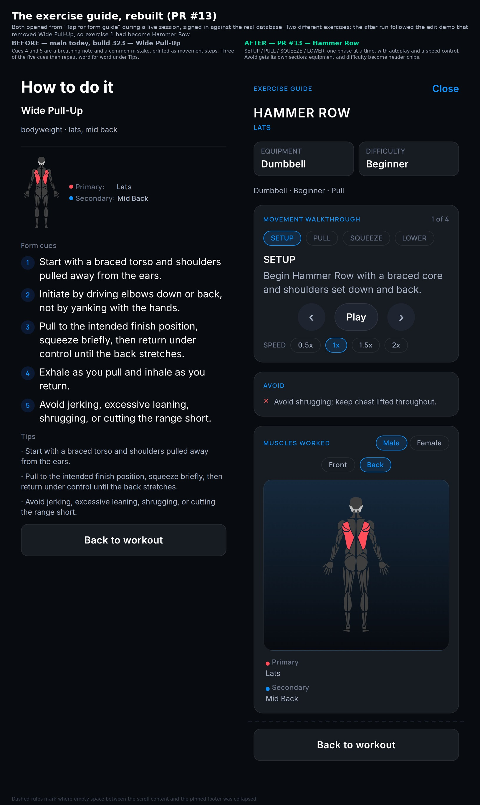
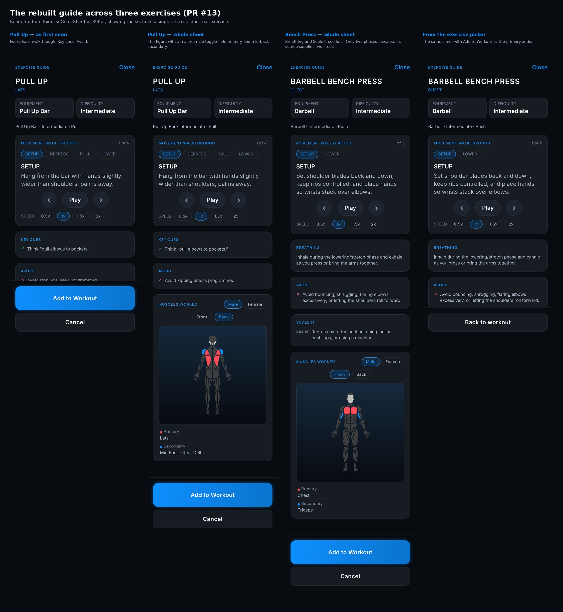
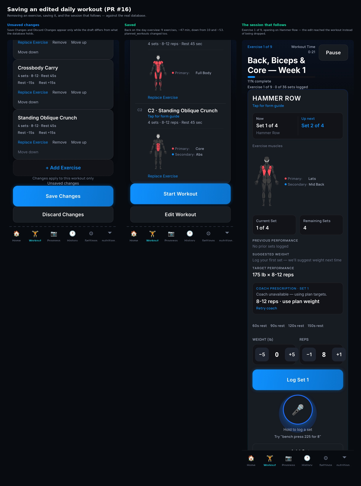
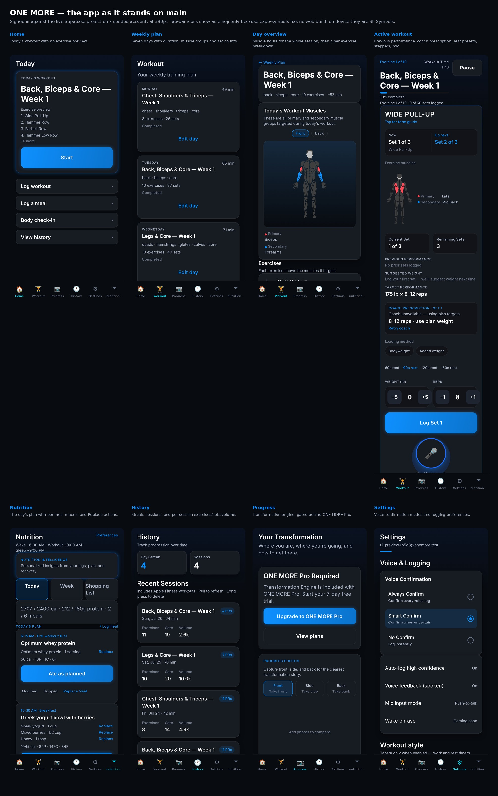

# Screenshots

Captured from the app running against the live Supabase project, at 390pt.

Two things to know about how these were made, so nothing here reads as more than it is:

- **Rendered on web**, via `react-native-web` under `EXPO_USE_METRO_STUBS=1`, not on a device. Layout,
  data and interaction are real; anything that depends on native code is not. Most visibly, the
  tab-bar icons fall back to emoji because `expo-symbols` has no web build — on a device they are SF
  Symbols.
- **Empty space is collapsed** where a screen pins its footer to the bottom. Capturing at a viewport
  taller than the scroll content leaves a dead band mid-screen; those bands are compressed and marked
  with a dashed rule. Nothing else is altered.

## The exercise guide (#13)

Left is what `main` ships today. Cues 4 and 5 are a breathing note and a common mistake, printed as
though they were movement steps, and three of the five cues repeat word for word under *Tips*. Right
is the rebuilt guide: a phase-by-phase walkthrough with autoplay, and Breathing / Avoid / Scale It
routed to their own sections.

The two panels are **different exercises** — the "after" capture came after the edit demo removed
Wide Pull-Up from the plan, so exercise 1 had become Hammer Row. The structural change is the same
either way.

Bench Press shows only two phases. That is not the component: its guide resolves through the Month 1
encyclopedia, which supplies two movement steps. Richer per-exercise step data would fill it out.

## Saving an edited daily workout (#16)

Removing an exercise, saving it, and the session that follows. The day overview comes back reading
9 exercises where it said 10, `planned_workouts.metadata` no longer contains Wide Pull-Up, and the
session opens on *Exercise 1 of 9* — the edit reached the workout rather than being dropped.

## The app as it stands on main

